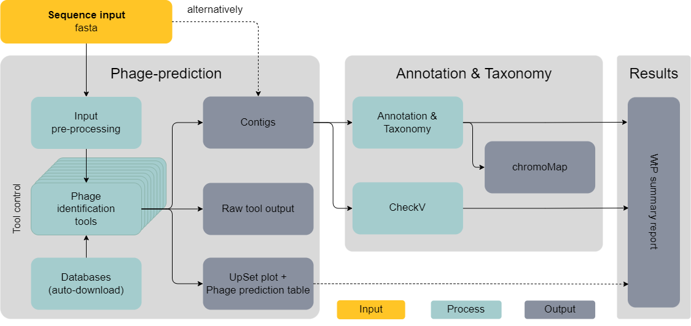

 

# Preprint:
> **What the Phage: A scalable workflow for the identification and analysis of phage sequences**
>
> M. Marquet, M. Hölzer, M. W. Pletz, A. Viehweger, O. Makarewicz, R. Ehricht, C. Brandt
>
> doi: https://doi.org/10.1101/2020.07.24.219899

-----------------------------------------
# System Requirements

| Components | minimum | reccomended |
|-|-|-|
| OS | Linux (Ubuntu)| Linux (Ubuntu) |
| Cores | 4 | 8 |
| Memory | 4 GB RAM | 8 GB RAM |
| Storage | 50 GB available space | 128-256 GB available space |

[Why so much space? -.-](troubleshooting.md)

-----------------------------------------

# TL;DR
* WtP is a scalable and easy-to-use workflow for phage identification and analysis. Our tool currently combines  9 established phage [identification tools](#included-bioinformatic-tools)  
* An attempt to streamline the usage of various phage identification and prediction tools  
* The main focus is stability and data filtering/analysis for the user  
* The tool is intended for fasta and fastq reads to identify phages in contigs/reads  
* a proper Prophage detection is not implemented (yet) - but a handful of tools report them - so they are mostly identified  

-----------------------------------------

# What the Phage
Phages are among the most abundant and diverse biological entities on earth. Identification from sequence data is a crucial first step to understand their impact on the environment. A variety of bacteriophage identification tools have been developed over the years. They differ in algorithmic approach, results and ease of use. We, therefore, developed “What the Phage” (WtP), an easy-to-use and parallel multitool approach for phage identification combined with an annotation and classification downstream strategy, thus, supporting the user’s decision-making process when the phage identification tools are not in agreement to each other. WtP is reproducible and scales to thousands of datasets through the use of a workflow manager (Nextflow).

-----------------------------------------

# Under the hood

*Figure 3:* This plot shows a simplified dag-chart of WtP for better understanding of what's going on behind the curtain  

-----------------------------------------

## Included identification tools
#### MARVEL  
[Citation](https://www.frontiersin.org/articles/10.3389/fgene.2018.00304/full) [github](https://github.com/LaboratorioBioinformatica/MARVEL#metagenomic-analysis-and-retrieval-of-viral-elements)

#### VirFinder  
[Citation](https://link.springer.com/epdf/10.1186/s40168-017-0283-5?) [github](https://github.com/jessieren/VirFinder)

#### PPR-Meta  
[Citation](https://www.ncbi.nlm.nih.gov/pmc/articles/PMC6586199/) [github](https://github.com/zhenchengfang/PPR-Meta)

#### VirSorter  
[Citation](https://peerj.com/articles/985/) [github](https://github.com/simroux/VirSorter)

#### MetaPhinder  
[Citation](https://journals.plos.org/plosone/article?id=10.1371/journal.pone.0163111) [github](https://github.com/vanessajurtz/MetaPhinder)

#### DeepVirFinder  
[Citation](https://arxiv.org/abs/1806.07810) [github](https://github.com/jessieren/DeepVirFinder)

#### Sourmash  
[Citation](https://joss.theoj.org/papers/10.21105/joss.00027) [github](https://github.com/dib-lab/sourmash)

#### VIBRANT  
[Citation](https://www.biorxiv.org/content/biorxiv/early/2019/11/26/855387.full.pdf) [github](https://github.com/AnantharamanLab/VIBRANT)

#### VirNet  
[Citation](https://ieeexplore.ieee.org/document/8639400) [github](https://github.com/alyosama/virnet)

#### Phigaro  
[Citation](https://www.biorxiv.org/content/10.1101/598243v1) [github](https://github.com/bobeobibo/phigaro)

#### Virsorter2 beta  
[github](https://github.com/jiarong/VirSorter2)

-----------------------------------------

.