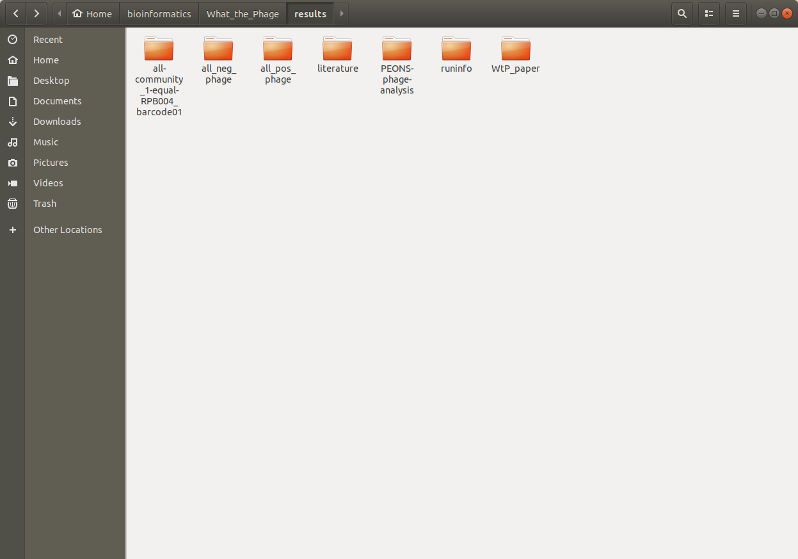
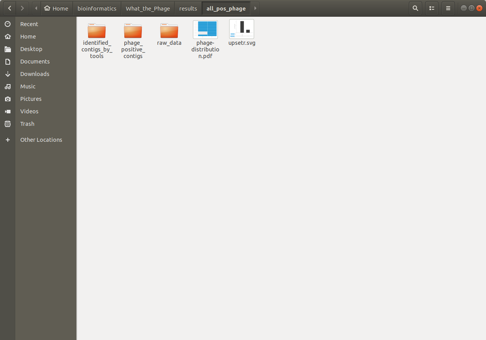
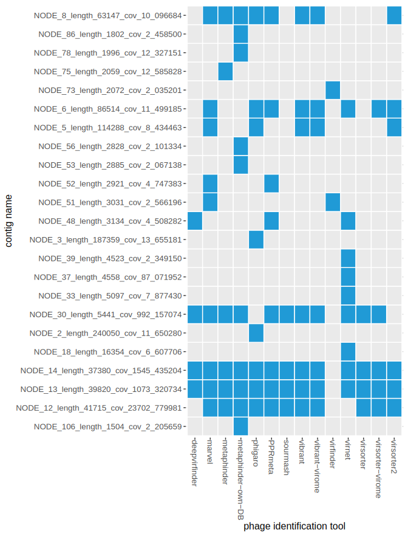

WtP will create a `results`-folder in your current working dir (where you executed WtP)  

* 

`literature`-folder  
 
 * you can import the `Citations.bib`-file in your citation program to have all the citations of the programs WtP uses for its analysis

`run info`-folder

`execution_report.html`: 

* this report gives an overview over:  
    * distribution of resource usage for each process (CPU, Memory, Job duration)  
    * information about each task in the workflow  

`execution_timeline.html`:  

 * this report gives youn an overview over the processes execution timeline  

--------------------------------------------------
# Sample folder

`identified_contigs_by_tools`  

  * contains toolname.txt files   
  * show the sequence-name(fasta-header) identified by the corresponding tool

`phage_positive_contigs`  

  * contains a multi-fasta-file with all the positive fasta-sequences identified by the tools

`raw_data`
  * contains the raw output from the phage-identification-tools packed as xyz.tar.gz -file

`upsetr.svg`  

*Figure 1:* This chart (UpSetR plot) quantifies the result-intersections of the phage identification tools, similar to a Venn diagram. The amount of positive phage-sequences identified by each tool is represented on the left barplot in blue. The dot plot shows via line connection(s) which of the tools identified the exact same positive phage sequences. The amount of these shared matches is quantified as a barplot above each corresponding dot pattern.

`annotation_results`

* [chromomap results](https://replikation.github.io/What_the_Phage/index.html)

*See Link:* The graphical output of the annotation shows an overview of the individual loci of the predicted ORFs and the corresponding genes in the fasta sequences identified as phages. For a better visibility, we have chosen 4 categories tail, capsid, baseplate, and other. This output can be used to verify the identified sequences (if the predicted sequences make sense or not). The annotation results are additionally plotted in an interactive HTML-file and are available as a file for further analysis.

`phage_distribution.pdf`

`taxonomic_classification`

`sample_overview_small.html`
``
``

folder for your analyzed sample:
* 
annotation stuff is missing here

## 1.  Identification Tool and contig overview (UpSetR)

*Figure 1:* This chart (UpSetR plot) quantifies the result-intersections of the phage identification tools, similar to a Venn diagram. The amount of positive phage-sequences identified by each tool is represented on the left barplot in blue. The dot plot shows via line connection(s) which of the tools identified the exact same positive phage sequences. The amount of these shared matches is quantified as a barplot above each corresponding dot pattern.

## 2. Tool comparison (Heatmap)
* 

## 3. Annotation Visualization (Chromomap) 
* [chromomap results](https://replikation.github.io/What_the_Phage/index.html)

*See Link:* The graphical output of the annotation shows an overview of the individual loci of the predicted ORFs and the corresponding genes in the fasta sequences identified as phages. For a better visibility, we have chosen 4 categories tail, capsid, baseplate, and other. This output can be used to verify the identified sequences (if the predicted sequences make sense or not). The annotation results are additionally plotted in an interactive HTML-file and are available as a file for further analysis.

## 4. Summary Table (checkV + Results)
* check [CheckV](https://bitbucket.org/berkeleylab/checkv/src/master/) for a detailed explanation

contig_id|	contig_length|	genome_copies|	gene_count|	viral_genes|	host_genes|	checkv_quality|	miuvig_quality|	completeness|	completeness_method|	contamination|	provirus|
|-|-|-|-|-|-|-|-|-|-|-|-|
pos_phage_0|	146647|	1|	243|	141|	1|	High-quality|	High-quality|	97.03|	AAI-based|	0|	No|
pos_phage_1|	58871|	1|	97|	21|	0|	High-quality|	High-quality|	100|	AAI-based|	0|	No|
pos_phage_2|	58560|	1|	95|	20|	0|	High-quality|	High-quality|	99.47|	AAI-based|	0|	No|
pos_phage_3|	59443|	1|	90|	52|	0|	High-quality|	High-quality|	100|	AAI-based|	0|	No|
pos_phage_4|	51290|	1|	74|	44|	0|	High-quality|	High-quality|	100|	AAI-based|	0|	No|
pos_phage_5|	43293|	1|	69|	55|	0|	High-quality|	High-quality|	100|	AAI-based|	0|	No|
pos_phage_6|	43851|	1|	53|	30|	0|	High-quality|	High-quality|	98.71|	AAI-based|	0|	No|
pos_phage_7|	44262|	1|	54|	31|	0|	High-quality|	High-quality|	99.64|	AAI-based|	0|	No|
pos_phage_8|	41865|	1|	60|	57|	0|	High-quality|	High-quality|	97.29|	AAI-based|	0|	No|
pos_phage_9|	221908|	1|	310|	48|	9|	High-quality|	High-quality|	100|	AAI-based|	0|	No|
